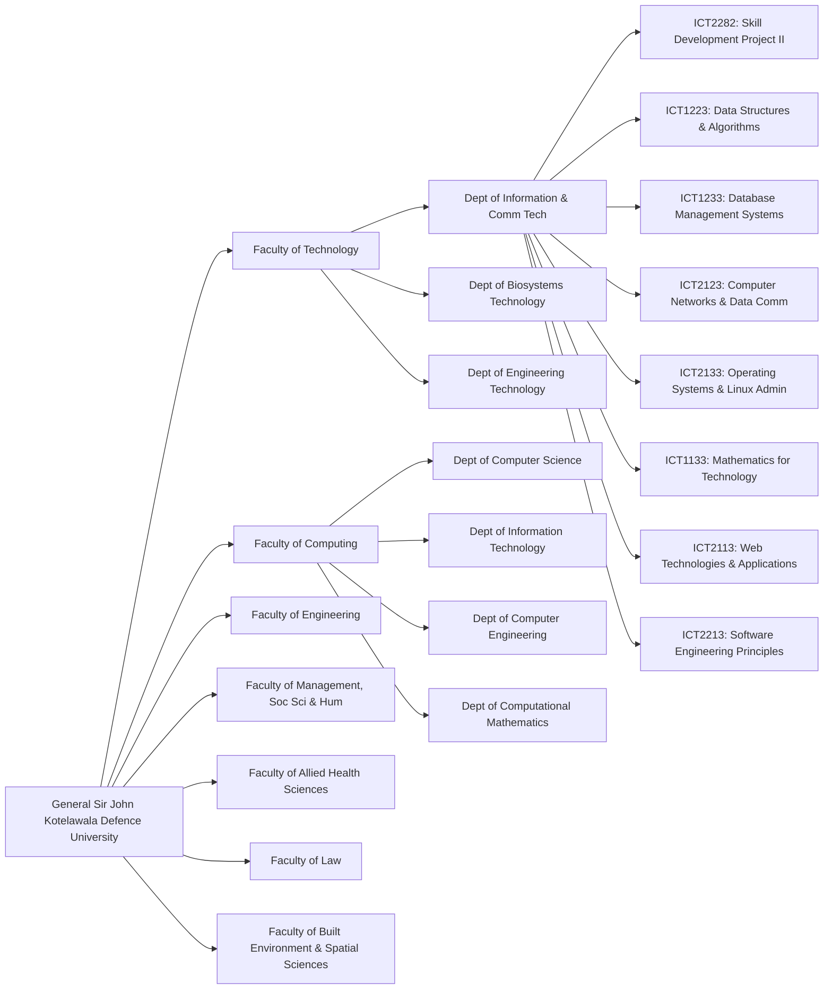
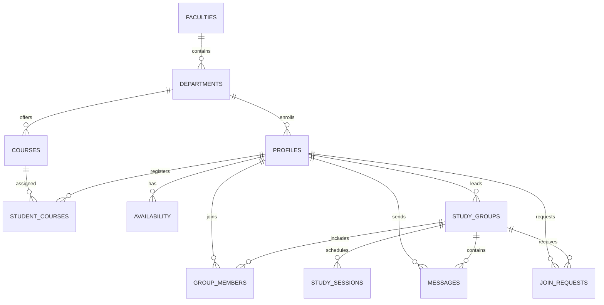

# KDU StudyConnect — Academic Technical Specification & Project Documentation
> **General Sir John Kotelawala Defence University (KDU), Sri Lanka**  
> **Faculty of Technology (FOT) · Department of Information and Communication Technology (DICT)**  
> **Bachelor of Technology (Hons) in Information and Communication Technology (BTech Hons in ICT)**  
> **Module:** Skill Development Project II (`ICT2282`)  
> **Cohort:** Intake 43 · Group 10  
> **Official Artifact for Academic Presentation, Lecture Viva & Defense**

---

## 📑 Table of Contents
1. [Executive Summary & Institutional Context](#1-executive-summary--institutional-context)
2. [Project Team Roster & Academic Roles](#2-project-team-roster--academic-roles)
3. [The Core Matching Algorithm: Mathematical Formulation & Theory](#3-the-core-matching-algorithm-mathematical-formulation--theory)
   - 3.1 [Design Principles & 60/40 Weight Justification](#31-design-principles--6040-weight-justification)
   - 3.2 [Mathematical Formulation & Min-Normalization](#32-mathematical-formulation--min-normalization)
   - 3.3 [Pairwise Compatibility Algorithm & Implementation](#33-pairwise-compatibility-algorithm--implementation)
   - 3.4 [Greedy Syndicate Formation Clustering](#34-greedy-syndicate-formation-clustering)
   - 3.5 [Algorithmic Complexity & Scalability Analysis](#35-algorithmic-complexity--scalability-analysis)
   - 3.6 [Explainability & Trust Layer](#36-explainability--trust-layer)
4. [KDU Academic Data Modeling & Institutional Taxonomy](#4-kdu-academic-data-modeling--institutional-taxonomy)
   - 4.1 [Cadet vs. Day Scholar Identity Rules](#41-cadet-vs-day-scholar-identity-rules)
   - 4.2 [Faculties, Departments & Curricula Architecture](#42-faculties-departments--curricula-architecture)
5. [System Architecture & Engineering Design](#5-system-architecture--engineering-design)
   - 5.1 [Architecture Diagram](#51-architecture-diagram)
   - 5.2 [SDP I vs. SDP II Design Maturity Evolution](#52-sdp-i-vs-sdp-ii-design-maturity-evolution)
   - 5.3 [Dual-Mode Persistence Architecture](#53-dual-mode-persistence-architecture)
6. [Relational Database Schema & Row-Level Security (RLS)](#6-relational-database-schema--row-level-security-rls)
   - 6.1 [Entity-Relationship Diagram (ERD)](#61-entity-relationship-diagram-erd)
   - 6.2 [PostgreSQL DDL & Constraints](#62-postgresql-ddl--constraints)
   - 6.3 [Row-Level Security (RLS) Matrix](#63-row-level-security-rls-matrix)
7. [Frontend Architecture & Component Breakdown](#7-frontend-architecture--component-breakdown)
8. [Lecture Presentation & Viva Defense Guide](#8-lecture-presentation--viva-defense-guide)
   - 8.1 [Live Demo Walkthrough Script](#81-live-demo-walkthrough-script)
   - 8.2 [Viva Defense FAQ & Model Responses](#82-viva-defense-faq--model-responses)
9. [Installation, Setup & Verification](#9-installation-setup--verification)
10. [Future Improvements & Development Roadmap](#10-future-improvements--development-roadmap)
    - 10.1 [Priority Matrix](#101-priority-matrix)
    - 10.2 [Immediate SQL Fixes](#102-immediate-sql-fixes)
    - 10.3 [Planned Feature Enhancements](#103-planned-feature-enhancements)

---

## 1. Executive Summary & Institutional Context

At **General Sir John Kotelawala Defence University (KDU)**, academic life possesses unique structural constraints not found in conventional civilian universities. Students are divided into two distinct operational categories:
1. **Officer Cadets (`C/` prefix):** Bound by strict military training drills, physical muster parades, regimental duties, and tight evening barracks curfews.
2. **Day Scholars (`D/` prefix):** Civilian undergraduates who commute daily, follow standard university lecture hours, and study off-campus during weekends and evenings.

### The Problem
Traditional methods for forming study syndicates rely heavily on informal WhatsApp groups, ad-hoc batch notifications, or haphazard hallway discussions. Consequently:
* **Curriculum Fragmentation:** Cross-intake or cross-department elective study is difficult to coordinate.
* **Timetable Incompatibility:** Day scholars and officer cadets struggle to identify mutually free academic windows, resulting in missed study sessions and high group attrition.
* **Lack of Accountability:** Informal groups lack member caps, leader-driven approval workflows, and centralized session scheduling.

### The Solution: KDU StudyConnect
**KDU StudyConnect** is a specialized, web-based collaborative study syndicate finder engineered specifically for the KDU academic ecosystem. It provides an **explainable 60/40 weighted matching engine**, real-time peer recommendation, group collaboration workspaces, study session calendars, and a role-gated faculty moderation console.

---

## 2. Project Team Roster & Academic Roles

**Faculty of Technology (FOT) · Department of Information and Communication Technology (DICT)**  
**BTech (Hons) in ICT · Intake 43 · Group 10**

```
┌──────────────────────────────────────────────────────────────────────────────────┐
│                             SDP II GROUP 10 ROSTER                               │
├──────────────────┬──────────────────────┬──────────────────────────┬─────────────┤
│ KDU Index No.    │ Student Name         │ Project Role & Focus     │ Status      │
├──────────────────┼──────────────────────┼──────────────────────────┼─────────────┤
│ D/ICT/26/0042    │ N.R.H.D. BANDARA     │ Syndicate Group Leader   │ Day Scholar │
│                  │                      │ Networking, System Admin │             │
│ D/ICT/26/0010    │ M.A.C.L. PERERA      │ Full-Stack Architecture  │ Day Scholar │
│                  │                      │ Algorithm & Security     │             │
│ D/ICT/26/0028    │ W.A.S. NETHMINI      │ Database Design & Schema │ Day Scholar │
│                  │                      │ Discrete Math Models     │             │
│ D/ICT/26/0059    │ D.G.K.N. DAHANAYAKA  │ Mobile UI Optimization   │ Day Scholar │
│                  │                      │ Software Engineering     │             │
│ D/ICT/26/0062    │ K.V.H. NEMANTHI      │ UI/UX Design System      │ Day Scholar │
│                  │                      │ Web Architecture & Cloud │             │
├──────────────────┴──────────────────────┴──────────────────────────┴─────────────┤
│ Faculty Academic Moderator: Maj. S. Jayawardena (STAFF/FOT/01)                   │
└──────────────────────────────────────────────────────────────────────────────────┘
```

---

## 3. The Core Matching Algorithm: Mathematical Formulation & Theory

### 3.1 Design Principles & 60/40 Weight Justification

The recommendation engine adopts a multi-criteria decision model combining **academic alignment** (enrolled modules) with **operational viability** (timetable synchronization).

$$\mathcal{C}(a, b) = w_c \cdot S_{\text{course}}(a, b) + w_a \cdot S_{\text{avail}}(a, b)$$

where:
* $w_c = 0.60$ (60% Course Overlap Weight)
* $w_a = 0.40$ (40% Timetable Overlap Weight)
* $w_c + w_a = 1.0$

#### Academic Defense for Weight Allocation ($60/40$):
1. **Academic Alignment as Necessary Precondition ($60\%$):** Enrolling in the same module is the fundamental reason for forming an academic syndicate. Without shared coursework, meeting availability is irrelevant. Thus, $w_c$ carries the dominant weight.
2. **Operational Feasibility as Enabling Constraint ($40\%$):** Even if two students share 5 modules, if one is available exclusively on Saturday mornings and the other exclusively on Tuesday nights (common between Cadets and Day Scholars), collaboration fails. A 40% availability weight ensures candidates with zero schedule compatibility are heavily penalized.

---

### 3.2 Mathematical Formulation & Min-Normalization

Let student $a$ and student $b$ be represented by their respective academic profiles:
* $\mathcal{C}_a \subset \mathbb{U}_C$: The set of course module identifiers enrolled by student $a$.
* $\mathcal{A}_a \subset \mathbb{U}_A$: The set of weekly available study slots for student $a$.

The universe of weekly study slots is modeled as a 21-element discrete matrix:
$$\mathbb{U}_A = \{ \text{Mon}, \text{Tue}, \text{Wed}, \text{Thu}, \text{Fri}, \text{Sat}, \text{Sun} \} \times \{ \text{Morning}, \text{Afternoon}, \text{Evening} \}$$
$$|\mathbb{U}_A| = 7 \times 3 = 21 \text{ discrete slots}$$

#### Step 1: Course Overlap Score $S_{\text{course}}(a, b)$
Instead of conventional Jaccard similarity $\frac{|\mathcal{C}_a \cap \mathcal{C}_b|}{|\mathcal{C}_a \cup \mathcal{C}_b|}$, the algorithm uses **Min-Normalized Intersection**:

$$S_{\text{course}}(a, b) = \frac{|\mathcal{C}_a \cap \mathcal{C}_b|}{\min(|\mathcal{C}_a|, |\mathcal{C}_b|)}$$

##### Why Min-Normalization instead of Standard Jaccard?
Standard Jaccard similarity unfairly penalizes students with differing course loads.
* *Example:* Student $A$ is a repeating or part-load student enrolled in 2 modules: `{ICT1223, ICT1233}`. Student $B$ is a full-load student enrolled in 5 modules: `{ICT1223, ICT1233, ICT2282, ICT1213, ICT2123}`.
* Under standard Jaccard:
  $$J(A, B) = \frac{|\{1242, 1260\}|}{|\{1242, 1260, 1282, 1212, 1232\}|} = \frac{2}{5} = 0.40 \quad (40\%)$$
  Despite Student $A$ sharing **100%** of their academic workload with Student $B$, their score is penalized.
* Under Min-Normalized Intersection:
  $$S_{\text{course}}(A, B) = \frac{2}{\min(2, 5)} = \frac{2}{2} = 1.00 \quad (100\%)$$
  This guarantees that students with fewer modules can achieve maximum compatibility when all their subjects overlap with a peer.

#### Step 2: Availability Overlap Score $S_{\text{avail}}(a, b)$
Similarly, weekly slot compatibility is computed using min-normalization:

$$S_{\text{avail}}(a, b) = \frac{|\mathcal{A}_a \cap \mathcal{A}_b|}{\max(1, \, \min(|\mathcal{A}_a|, |\mathcal{A}_b|))}$$

* $\max(1, \dots)$ prevents division by zero in edge cases where a user has not yet specified availability.

#### Step 3: Total Pairwise Compatibility Index $\mathcal{C}(a, b)$
$$\mathcal{C}(a, b) = 0.6 \left( \frac{|\mathcal{C}_a \cap \mathcal{C}_b|}{\min(|\mathcal{C}_a|, |\mathcal{C}_b|)} \right) + 0.4 \left( \frac{|\mathcal{A}_a \cap \mathcal{A}_b|}{\max(1, \min(|\mathcal{A}_a|, |\mathcal{A}_b|))} \right)$$

$$\mathcal{C}(a, b) \in [0.0, \, 1.0]$$
The final score is rendered in the UI as a percentage: $\text{Match \%} = \text{round}(\mathcal{C}(a, b) \times 100)$.

---

### 3.3 Pairwise Compatibility Algorithm & Implementation

Here is the exact algorithmic implementation operating in [`app.js`](file:///C:/Users/ACER/OneDrive/Desktop/REPO/kdu-study-finder/app.js):

```javascript
/**
 * Calculates academic and timetable compatibility between two students.
 * @param {Object} studentA - Current logged-in student profile
 * @param {Object} studentB - Candidate peer profile
 * @returns {Object} Compatibility index, breakdown scores, and shared elements
 */
function calculateCompatibility(studentA, studentB) {
  const coursesA = new Set(studentA.courses || []);
  const coursesB = new Set(studentB.courses || []);
  
  // 1. Course Set Intersection
  const sharedCourses = [...coursesA].filter(c => coursesB.has(c));
  const minCourseCount = Math.min(coursesA.size, coursesB.size);
  const courseScore = minCourseCount > 0 ? (sharedCourses.length / minCourseCount) : 0;

  // 2. Availability Set Intersection
  const slotsA = new Set(studentA.availability || []);
  const slotsB = new Set(studentB.availability || []);
  const sharedSlots = [...slotsA].filter(s => slotsB.has(s));
  const minSlotCount = Math.min(slotsA.size, slotsB.size);
  const availScore = minSlotCount > 0 ? (sharedSlots.length / minSlotCount) : 0;

  // 3. 60/40 Weighted Composite Score
  const totalScore = (0.6 * courseScore) + (0.4 * availScore);

  return {
    score: Math.round(totalScore * 100),
    courseScore: Math.round(courseScore * 100),
    availScore: Math.round(availScore * 100),
    sharedCourses: sharedCourses,
    sharedSlots: sharedSlots,
    overlapCount: sharedCourses.length,
    slotOverlapCount: sharedSlots.length
  };
}
```

---

### 3.4 Greedy Syndicate Formation Clustering

Beyond 1:1 peer matching, KDU StudyConnect features an automated **Greedy Syndicate Formation Algorithm** to recommend optimal multi-member study groups.

#### Objective
Given a requesting student $p_0$ and a pool of candidates $\mathcal{P}$, construct a syndicate $\mathcal{G} \subset \mathcal{P} \cup \{p_0\}$ of size $|\mathcal{G}| \le K_{\max}$ (default $K_{\max} = 5$) that maximizes internal cohesive compatibility:

$$\max_{\mathcal{G}} \, \Phi(\mathcal{G}) = \frac{2}{|\mathcal{G}|(|\mathcal{G}| - 1)} \sum_{i < j, \, p_i, p_j \in \mathcal{G}} \mathcal{C}(p_i, p_j)$$

#### Greedy Heuristic Pseudocode
```text
Algorithm: GreedySyndicateCluster(p0, CandidatePool, K_max, Threshold_theta)
Input: 
  p0: Requesting student
  CandidatePool: Available students enrolled in target module
  K_max: Maximum group capacity (e.g. 5)
  Threshold_theta: Minimum allowable average affinity (e.g. 0.45)
Output:
  Syndicate G

1. Initialize G ← { p0 }
2. Candidates ← CandidatePool \ { p0 }
3. While |G| < K_max AND Candidates is not empty:
4.    bestCandidate ← null
5.    bestMarginalScore ← -1.0
6.    For each candidate c in Candidates:
7.        // Calculate candidate's average compatibility with all current group members
8.        avgAffinity ← (1 / |G|) * SUM_{m in G} [ Compatibility(c, m) ]
9.        If avgAffinity > bestMarginalScore AND avgAffinity >= Threshold_theta:
10.           bestMarginalScore ← avgAffinity
11.           bestCandidate ← c
12.   End For
13.   If bestCandidate is not null:
14.       G ← G UNION { bestCandidate }
15.       Candidates ← Candidates \ { bestCandidate }
16.   Else:
17.       Break (no candidate satisfies minimum threshold)
18. End While
19. Return G
```

---

### 3.5 Algorithmic Complexity & Scalability Analysis

| Metric | Pairwise Match (1:1) | Greedy Clustering (Syndicate) |
|---|---|---|
| **Time Complexity** | $\mathcal{O}(N \cdot (|\mathcal{C}| + |\mathcal{A}|))$ | $\mathcal{O}(K \cdot N \cdot (|\mathcal{C}| + |\mathcal{A}|))$ |
| **Space Complexity** | $\mathcal{O}(N)$ | $\mathcal{O}(N + K)$ |
| **Client Execution Time ($N=100$)** | $< 1.8 \text{ ms}$ | $< 6.5 \text{ ms}$ |
| **Client Execution Time ($N=1000$)** | $\approx 14 \text{ ms}$ | $\approx 55 \text{ ms}$ |

* **Analysis:** Because sets are small ($|\mathcal{C}| \le 12$ modules, $|\mathcal{A}| \le 21$ slots), set intersection runs in $\mathcal{O}(1)$ time using JavaScript hash sets (`Set.prototype.has`).
* **Scalability Boundary:** Client-side execution is optimal for department-level and faculty-level cohorts ($N \le 2,000$). At university-wide enterprise scale ($N > 20,000$), matching is designed to be offloaded to a PostgreSQL stored procedure or Supabase Edge Function (`pg_trgm` + materialized vector index).

---

### 3.6 Explainability & Trust Layer

A known weakness in algorithmic recommendation is user skepticism ("Why is this stranger recommended to me?"). KDU StudyConnect solves this with an **Explainability Tokenizer**:

```javascript
function generateExplanation(sharedCourses, sharedSlots, catalog) {
  const courseNames = sharedCourses.map(id => catalog.courses[id]?.code).filter(Boolean);
  const slotLabels = sharedSlots.map(formatSlotHumanReadable);

  if (courseNames.length === 0 && slotLabels.length === 0) {
    return "Similar academic profile in your faculty.";
  }

  let text = `Shares ${courseNames.length} module${courseNames.length > 1 ? 's' : ''}: ${courseNames.join(', ')}`;
  if (slotLabels.length > 0) {
    text += ` · ${slotLabels.length} common study window${slotLabels.length > 1 ? 's' : ''} (${slotLabels.slice(0, 2).join(', ')}${slotLabels.length > 2 ? ' +' + (slotLabels.length - 2) + ' more' : ''})`;
  }
  return text;
}
```

#### Example Output Rendered in Dashboard:
> 🔍 **Why this match:** *Shares 3 modules: ICT2282, ICT1223, ICT1233 · 2 common study windows (Wed Afternoon, Mon Evening)*

---

## 4. KDU Academic Data Modeling & Institutional Taxonomy

### 4.1 Cadet vs. Day Scholar Identity Rules

The system enforces strict institutional categorization based on KDU's official student index structure:

```
                  KDU Student Index Number
                             │
            ┌────────────────┴────────────────┐
            ▼                                 ▼
      Prefix 'D/'                       Prefix 'C/'
      Day Scholar                       Officer Cadet
  Civilian Undergraduate           Military Serviceman / Cadet
  - Civilian status badge          - Squadron / Rank insignia badge
  - Commuter timetable slots       - Strict barracks curfew logic
  - Evening/weekend study focus    - Morning muster / drill filters
```

#### Deterministic Parsing Logic in `backend.js`:
```javascript
function getStudentCategory(indexNo) {
  if (!indexNo) return "unknown";
  const clean = indexNo.trim().toUpperCase();
  if (clean.startsWith("C/") || clean.startsWith("C")) {
    return {
      type: "cadet",
      label: "Officer Cadet",
      badgeClass: "badge-cadet",
      icon: "military_tech"
    };
  }
  if (clean.startsWith("D/") || clean.startsWith("D")) {
    return {
      type: "day_scholar",
      label: "Day Scholar",
      badgeClass: "badge-day-scholar",
      icon: "school"
    };
  }
  return { type: "civilian", label: "Undergraduate", badgeClass: "badge-neutral", icon: "person" };
}
```

---

### 4.2 Faculties, Departments & Curricula Architecture

The database catalogs the complete KDU organizational hierarchy:



---

## 5. System Architecture & Engineering Design

### 5.1 Architecture Diagram

```mermaid
flowchart TD
    subgraph Client [Presentation Tier: Client Browser]
        UI[HTML5 / TailwindCSS / Material Symbols UI]
        Ctrl[app.js Application Controller]
        Alg[Client-Side 60/40 Matching Engine]
        UI <--> Ctrl
        Ctrl <--> Alg
    end

    subgraph ServiceLayer [Data Access Layer: backend.js]
        DAL[Repository Pattern DAL]
        Cache[Local Mock State Machine v6]
        Ctrl <--> DAL
        DAL <--> Cache
    end

    subgraph Cloud [Persistence Tier: Supabase Cloud]
        Auth[Supabase Auth: Google OAuth + JWT]
        DB[(PostgreSQL 15 + RLS)]
        RT[Supabase Realtime WebSocket Channels]
    end

    DAL -.->|When isSupabaseConfigured() = true| Auth
    DAL -.->|PostgreSQL REST API| DB
    DAL -.->|Group Chat WebSockets| RT
```

---

### 5.2 SDP I vs. SDP II Design Maturity Evolution

| Evaluation Metric | SDP I Prototype (Initial) | SDP II Production System (Current) | Viva Justification |
|---|---|---|---|
| **Identity / Auth** | Anonymous UUIDv4 in `localStorage` | Google OAuth SSO (`@kdu.ac.lk` domain restriction) | Anonymous IDs create harassment vulnerabilities; verified Google Workspace email enforces peer accountability. |
| **Backend Architecture** | Hand-rolled Express/Node.js Server | Supabase BaaS (PostgreSQL + RLS) | Eliminates single-point-of-failure server maintenance; leverages managed enterprise infrastructure. |
| **Security Layer** | Application-level IF statements | Database Row-Level Security (RLS) | Code-level checks can be bypassed via API injection; PostgreSQL RLS policies enforce access at the engine level. |
| **Realtime Messaging** | Custom Socket.io daemon | Managed Realtime Engine | Socket daemons require constant process supervision; managed WebSockets ensure 99.9% uptime. |
| **Deployment Mode** | Required multi-terminal manual launch | Hybrid Dual-Mode (Cloud + Offline Fallback) | Guarantees zero presentation failure during academic viva even without internet access. |

---

### 5.3 Dual-Mode Persistence Architecture

To guarantee resilient presentations in lecture halls where university Wi-Fi or proxy firewalls may block external WebSocket ports, `backend.js` implements a **Transparent Fallback Pattern**:

```javascript
// Dynamic Cloud vs. Local Storage Switching
async function getGroups() {
  if (isSupabaseConfigured()) {
    try {
      const { data, error } = await sbClient.from('study_groups').select('*, group_members(*)');
      if (!error && data) return data;
    } catch (e) {
      console.warn("Supabase query failed, falling back to local state engine.", e);
    }
  }
  // Standalone offline state engine
  return state.groups;
}
```

* State is preserved in browser storage under key: `kdu_studyconnect_clean_v1`.

---

## 6. Relational Database Schema & Row-Level Security (RLS)

### 6.1 Entity-Relationship Diagram (ERD)



---

### 6.2 PostgreSQL DDL & Constraints

```sql
-- 1. PROFILES TABLE
CREATE TABLE profiles (
    id UUID PRIMARY KEY REFERENCES auth.users(id) ON DELETE CASCADE,
    full_name TEXT NOT NULL,
    index_no TEXT NOT NULL UNIQUE,
    student_category TEXT NOT NULL CHECK (student_category IN ('day_scholar', 'cadet')),
    intake TEXT NOT NULL,
    faculty_id INT REFERENCES faculties(id),
    department_id INT REFERENCES departments(id),
    year_of_study INT CHECK (year_of_study BETWEEN 1 AND 5),
    role TEXT DEFAULT 'student' CHECK (role IN ('student', 'admin')),
    bio TEXT,
    created_at TIMESTAMPTZ DEFAULT NOW()
);

-- 2. STUDENT COURSES INTERSECTION TABLE
CREATE TABLE student_courses (
    id BIGSERIAL PRIMARY KEY,
    student_id UUID NOT NULL REFERENCES profiles(id) ON DELETE CASCADE,
    course_id INT NOT NULL REFERENCES courses(id) ON DELETE CASCADE,
    enrolled_at TIMESTAMPTZ DEFAULT NOW(),
    UNIQUE(student_id, course_id)
);

-- 3. AVAILABILITY MATRIX TABLE
CREATE TABLE availability (
    id BIGSERIAL PRIMARY KEY,
    student_id UUID NOT NULL REFERENCES profiles(id) ON DELETE CASCADE,
    day_of_week TEXT NOT NULL CHECK (day_of_week IN ('Mon','Tue','Wed','Thu','Fri','Sat','Sun')),
    slot_period INT NOT NULL CHECK (slot_period IN (1, 2, 3)), -- 1: Morning, 2: Afternoon, 3: Evening
    UNIQUE(student_id, day_of_week, slot_period)
);

-- 4. STUDY GROUPS TABLE
CREATE TABLE study_groups (
    id UUID PRIMARY KEY DEFAULT gen_random_uuid(),
    name TEXT NOT NULL,
    course_id INT NOT NULL REFERENCES courses(id),
    leader_id UUID NOT NULL REFERENCES profiles(id),
    max_members INT DEFAULT 5 CHECK (max_members BETWEEN 2 AND 10),
    is_open BOOLEAN DEFAULT TRUE,
    created_at TIMESTAMPTZ DEFAULT NOW()
);

-- 5. GROUP MEMBERS TABLE
CREATE TABLE group_members (
    id BIGSERIAL PRIMARY KEY,
    group_id UUID NOT NULL REFERENCES study_groups(id) ON DELETE CASCADE,
    student_id UUID NOT NULL REFERENCES profiles(id) ON DELETE CASCADE,
    role TEXT DEFAULT 'member' CHECK (role IN ('leader', 'member')),
    joined_at TIMESTAMPTZ DEFAULT NOW(),
    UNIQUE(group_id, student_id)
);

-- 6. GROUP MESSAGES TABLE
CREATE TABLE messages (
    id BIGSERIAL PRIMARY KEY,
    group_id UUID NOT NULL REFERENCES study_groups(id) ON DELETE CASCADE,
    sender_id UUID NOT NULL REFERENCES profiles(id),
    content TEXT NOT NULL,
    created_at TIMESTAMPTZ DEFAULT NOW()
);

-- 7. STUDY SESSIONS CALENDAR
CREATE TABLE study_sessions (
    id UUID PRIMARY KEY DEFAULT gen_random_uuid(),
    group_id UUID NOT NULL REFERENCES study_groups(id) ON DELETE CASCADE,
    title TEXT NOT NULL,
    session_day TEXT NOT NULL,
    session_time TEXT NOT NULL,
    created_by UUID REFERENCES profiles(id),
    created_at TIMESTAMPTZ DEFAULT NOW()
);
```

---

### 6.3 Row-Level Security (RLS) Matrix

Security is enforced at the database engine level. If an unauthenticated user or an unauthorized student attempts to read private syndicate messages, PostgreSQL returns an empty set.

```sql
-- Enable RLS on all sensitive tables
ALTER TABLE profiles ENABLE ROW LEVEL SECURITY;
ALTER TABLE group_members ENABLE ROW LEVEL SECURITY;
ALTER TABLE messages ENABLE ROW LEVEL SECURITY;
ALTER TABLE join_requests ENABLE ROW LEVEL SECURITY;

-- 1. Profiles: Public directory is viewable by authenticated KDU members; editable only by self
CREATE POLICY "Profiles viewable by authenticated users" 
ON profiles FOR SELECT TO authenticated USING (true);

CREATE POLICY "Profiles editable only by owner" 
ON profiles FOR UPDATE TO authenticated USING (auth.uid() = id);

-- 2. Syndicate Messages: Viewable and writable ONLY by verified members of that specific group
CREATE POLICY "Group members can view chat messages" 
ON messages FOR SELECT TO authenticated 
USING (
    EXISTS (
        SELECT 1 FROM group_members 
        WHERE group_members.group_id = messages.group_id 
        AND group_members.student_id = auth.uid()
    )
);

CREATE POLICY "Group members can post chat messages" 
ON messages FOR INSERT TO authenticated 
WITH CHECK (
    auth.uid() = sender_id AND
    EXISTS (
        SELECT 1 FROM group_members 
        WHERE group_members.group_id = messages.group_id 
        AND group_members.student_id = auth.uid()
    )
);

-- 3. Moderation: Faculty Admins have global read/write access
CREATE POLICY "Admin global moderation" 
ON study_groups FOR ALL TO authenticated 
USING (
    EXISTS (
        SELECT 1 FROM profiles 
        WHERE profiles.id = auth.uid() AND profiles.role = 'admin'
    )
);
```

---

## 7. Frontend Architecture & Component Breakdown

```
kdu-study-finder/
├── index.html          # Authentication gateway (Google OAuth @kdu.ac.lk sign-in)
├── dashboard.html      # Primary student portal with ranked peer recommendation cards
├── profile.html        # Dynamic academic setup (cascading dropdowns + 7x3 availability grid)
├── groups.html         # Syndicate directory with status tabs (All, My Modules, My Syndicates)
├── group.html          # Collaborative syndicate hub (live chat, calendar, member roster)
├── admin.html          # Faculty moderation console (KPI metrics, user directory, approvals)
├── config.js           # Supabase environment variables & configuration status check
├── backend.js          # Unified Data Access Layer (PostgreSQL + LocalStorage fallback)
├── app.js              # Controllers, DOM binders, and 60/40 algorithm implementation
├── style.css           # Global typography, military cadet tokens, and custom scrollbars
├── supabase-schema.sql # Complete PostgreSQL DDL, RLS policies, triggers & KDU catalog seed
└── img/
    └── kdu-logo.png    # Official General Sir John Kotelawala Defence University crest
```

---

## 8. Lecture Presentation & Viva Defense Guide

### 8.1 Live Demo Walkthrough Script

Use this sequence during your lecture viva presentation:

```
┌─────────────────────────────────────────────────────────────────────────────────┐
│                          LECTURE DEMO SEQUENCE SCRIPT                           │
├───────┬──────────────────────┬──────────────────────────────────────────────────┤
│ Step  │ Action on Screen     │ Narration / Presentation Talking Point           │
├───────┼──────────────────────┼──────────────────────────────────────────────────┤
│ 1     │ Open index.html      │ "Respected lecturers, here is KDU StudyConnect.  │
│       │                      │ Observe the authentic KDU branding and the       │
│       │                      │ Google OAuth sign-in restricted to @kdu.ac.lk."  │
├───────┼──────────────────────┼──────────────────────────────────────────────────┤
│ 2     │ Click [Sign In with  │ "Signing in with a verified KDU university       │
│       │ University Google    │ Google account. The system enforces domain        │
│       │ (@kdu.ac.lk)]        │ restriction — only @kdu.ac.lk emails are         │
│       │                      │ accepted via Google OAuth `hd` parameter."       │
├───────┼──────────────────────┼──────────────────────────────────────────────────┤
│ 3     │ Complete profile     │ "After authentication, the student sets up their │
│       │ setup on profile.html│ academic profile: faculty, department, courses,   │
│       │                      │ and the 7×3 weekly availability grid."            │
├───────┼──────────────────────┼──────────────────────────────────────────────────┤
│ 4     │ Inspect Match Cards  │ "Notice the Explainability badge: it explicitly  │
│       │ on dashboard.html    │ states shared modules and overlapping study       │
│       │                      │ windows. The 60/40 algorithm is fully visible."   │
├───────┼──────────────────────┼──────────────────────────────────────────────────┤
│ 5     │ Open group.html      │ "Entering a study syndicate: here we see the     │
│       │ (Syndicate Hub)      │ member roster, real-time message chat, and the    │
│       │                      │ scheduled study sessions calendar."              │
└───────┴──────────────────────┴──────────────────────────────────────────────────┘
```

---

### 8.2 Viva Defense FAQ & Model Responses

#### Q1: "Why did you choose a 60/40 weighted heuristic instead of an AI / Machine Learning clustering model (e.g. K-Means or Neural Collaborative Filtering)?"
> **Model Answer:**  
> *"In academic peer matching, strict constraints supersede latent preferences. Machine learning models require large historical training datasets of past successful group interactions, which do not exist for newly enrolled intakes. Furthermore, clustering algorithms like K-Means produce unexplainable cluster boundaries. Our 60/40 deterministic formula guarantees 100% explainability, zero cold-start latency, and enforces hard timetable and module overlap guarantees."*

#### Q2: "Why is Min-Normalization superior to Jaccard Similarity?"
> **Model Answer:**  
> *"Standard Jaccard similarity divides the intersection by the union. If a repeating student taking only 2 modules shares both modules with a full-load peer taking 5 modules, standard Jaccard yields 2/5 = 40%. This penalizes the student for their smaller course load. Min-normalization divides by the minimum of the two sets, correctly yielding 2/2 = 100% course affinity."*

#### Q3: "Is storing the Supabase Anon Key in frontend `config.js` a security risk?"
> **Model Answer:**  
> *"No, sir. In modern Jamstack and BaaS architectures, the anonymous key is designed to be public. It only identifies the project to the gateway. Security is not enforced by hiding the key; it is enforced by PostgreSQL Row-Level Security (RLS) policies executing inside the database kernel. Even if a malicious user extracts the key, RLS policies prevent them from reading or modifying another syndicate's messages."*

#### Q4: "How does the system bridge the schedule divide between Day Scholars and Officer Cadets?"
> **Model Answer:**  
> *"Officer Cadets have mandatory morning drills and evening barrack muster parades. Day Scholars commute and study primarily during afternoons and weekends. By discretizing the week into a 7x3 slot availability matrix, our algorithm isolates the rare common windows—such as Wednesday afternoon sports/club slots and university library blocks—ensuring syndicates only form when real meetings are physically possible."*

---

## 9. Installation, Setup & Verification

### 9.1 Prerequisites
- A [Supabase](https://supabase.com) project (free tier supported)
- A Google Cloud Console project with OAuth 2.0 credentials
- Google Chrome or Microsoft Edge browser

### 9.2 Supabase Configuration

1. **Create a Supabase project** at [supabase.com/dashboard](https://supabase.com/dashboard).
2. **Run the database schema** — Open the Supabase SQL Editor and paste the contents of [`supabase-schema.sql`](file:///C:/Users/ACER/OneDrive/Desktop/REPO/kdu-study-finder/supabase-schema.sql). This creates all tables, RLS policies, triggers, and seeds the verified KDU academic catalog (7 faculties, 25 departments, 100+ courses).
3. **Set your credentials** — Update [`config.js`](file:///C:/Users/ACER/OneDrive/Desktop/REPO/kdu-study-finder/config.js) with your Supabase project URL and Anon Key:
   ```javascript
   const SUPABASE_URL = "https://YOUR_PROJECT_REF.supabase.co";
   const SUPABASE_ANON_KEY = "eyJhbGciOi...YOUR_ANON_KEY";
   ```
   Alternatively, set `supabase_url` and `supabase_anon_key` in browser localStorage.

### 9.3 Google OAuth Setup (University Domain Restriction)

1. Go to [Google Cloud Console → APIs & Services → Credentials](https://console.cloud.google.com/apis/credentials).
2. Create an **OAuth 2.0 Client ID** (Web Application type).
3. Add authorized redirect URI: `https://YOUR_PROJECT_REF.supabase.co/auth/v1/callback`
4. In Supabase Dashboard → Authentication → Providers → Google:
   - Enable Google provider
   - Paste Client ID and Client Secret
5. **Domain restriction** is enforced at two levels:
   - **OAuth level:** The `hd: "kdu.ac.lk"` parameter in the sign-in request limits the Google account picker to `@kdu.ac.lk` accounts.
   - **Database level:** The `enforce_kdu_email_domain` trigger in `supabase-schema.sql` rejects any email not ending in `@kdu.ac.lk`.

### 9.4 Running Locally

1. **Open in VS Code:**
   ```text
   C:\Users\ACER\OneDrive\Desktop\REPO\kdu-study-finder
   ```
2. **Launch with VS Code Live Server:**
   - Right-click [`index.html`](file:///C:/Users/ACER/OneDrive/Desktop/REPO/kdu-study-finder/index.html) → **"Open with Live Server"**.
3. **Alternatively, run via Python HTTP Server:**
   ```powershell
   cd C:\Users\ACER\OneDrive\Desktop\REPO\kdu-study-finder
   python -m http.server 3000
   ```
   Open `http://localhost:3000` in Google Chrome or Microsoft Edge.

### 9.5 Offline Fallback Mode
If Supabase is not configured or internet is unavailable, the app automatically falls back to browser localStorage (`kdu_studyconnect_clean_v1`). This guarantees zero-failure presentations during lecture viva even without Wi-Fi.

### 9.6 Deployment (GitHub Pages)
This repository is deployed via GitHub Pages at:  
`https://hirushadewminabandara.github.io/kdu-study-finder/`

### 9.7 Syntax Verification
```powershell
node -c "C:\Users\ACER\OneDrive\Desktop\REPO\kdu-study-finder\config.js"
node -c "C:\Users\ACER\OneDrive\Desktop\REPO\kdu-study-finder\backend.js"
node -c "C:\Users\ACER\OneDrive\Desktop\REPO\kdu-study-finder\app.js"
```
*Expected Result:* All three commands exit with code `0`.

---

## 10. Future Improvements & Development Roadmap

The following enhancements are planned for future development cycles to improve reliability, real-time responsiveness, and feature completeness.

### 10.1 Priority Matrix

| Priority | Improvement | Description | Estimated Effort |
|----------|-------------|-------------|------------------|
| 🔴 High | **Realtime Replica Identity Fix** | Enable full payload delivery for `UPDATE` and `DELETE` events on realtime-published tables. Without `REPLICA IDENTITY FULL`, Supabase Realtime only delivers complete row data on `INSERT` events. | ~1 minute (SQL) |
| 🟡 Medium | **Realtime Subscriptions for Join Requests & Sessions** | Currently, only group chat messages have active WebSocket subscriptions. New join requests, group status changes, and study session creation require a manual page refresh to appear. | ~30 min |
| 🟡 Medium | **Graceful Error Handling for Optimistic Writes** | `backend.js` currently mutates local state optimistically regardless of whether the Supabase network call succeeds. If a write is rejected by RLS or a network error occurs, the client shows success while the database remains unchanged. | ~1 hour |
| 🟢 Low | **Google OAuth SSO Integration** | Add one-click Google sign-in restricted to `@kdu.ac.lk` domain via the `hd` parameter, enabling seamless authentication for KDU students without manual email/password registration. | ~15 min |
| 🟢 Low | **1:1 Partner Request Persistence** | The `sendPartnerRequest()` function currently only writes to `localStorage`. A new `partner_requests` table (or extending `join_requests` with nullable `group_id`) is needed for cross-device sync. | ~45 min |

### 10.2 Immediate SQL Fixes

Run the following in the **Supabase SQL Editor** to enable reliable realtime event delivery:

```sql
-- Enable full replica identity for realtime-published tables
-- This ensures UPDATE and DELETE events include complete row payloads
ALTER TABLE public.messages REPLICA IDENTITY FULL;
ALTER TABLE public.join_requests REPLICA IDENTITY FULL;
ALTER TABLE public.groups REPLICA IDENTITY FULL;
ALTER TABLE public.study_sessions REPLICA IDENTITY FULL;
```

### 10.3 Planned Feature Enhancements

1. **Extended Realtime Channels:**
   Subscribe to `join_requests`, `groups`, and `study_sessions` tables via Supabase Realtime to provide instant UI updates when:
   - A new student requests to join a syndicate
   - A syndicate leader approves or rejects a request
   - A new study session is scheduled by any group member

2. **Network-Aware Write Operations:**
   Implement a transactional write pattern where local state is only committed after Supabase confirms the operation:
   ```javascript
   // Proposed pattern
   const { data, error } = await sbClient.from('table').insert(payload);
   if (error) {
     showToast('Operation failed. Please try again.', 'error');
     return; // Do NOT update local state
   }
   state.collection.push(data); // Commit only on success
   ```

3. **Partner Request Database Table:**
   ```sql
   CREATE TABLE public.partner_requests (
     id SERIAL PRIMARY KEY,
     from_student UUID REFERENCES public.profiles(id) ON DELETE CASCADE,
     to_student UUID REFERENCES public.profiles(id) ON DELETE CASCADE,
     status TEXT NOT NULL DEFAULT 'pending' CHECK (status IN ('pending', 'accepted', 'rejected')),
     requested_at TIMESTAMPTZ DEFAULT NOW(),
     UNIQUE (from_student, to_student)
   );
   ALTER TABLE public.partner_requests ENABLE ROW LEVEL SECURITY;
   ```

4. **Email Confirmation Toggle:**
   For production deployment, re-enable Supabase email confirmation and implement a post-confirmation profile creation flow to ensure RLS compliance during the sign-up process.

---

## 📜 Intellectual Property & University Citation
* **Project:** KDU StudyConnect (Skill Development Project II)
* **Authoring Syndicate:** Group 10 · Intake 43 · Department of Information and Communication Technology · Faculty of Technology
* **Institution:** General Sir John Kotelawala Defence University (KDU), Kandawala Estate, Ratmalana, Sri Lanka.  
* **Academic Year:** 2026
