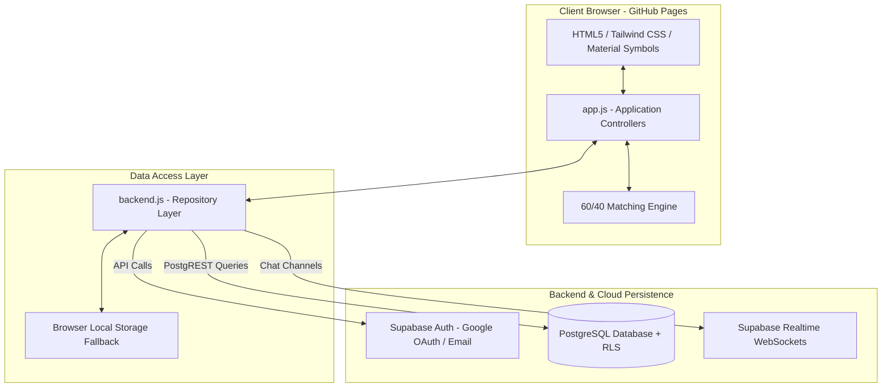
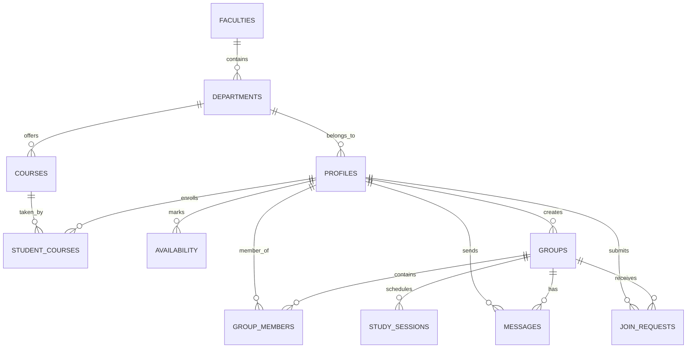

# KDU StudyConnect

A collaborative study group and peer finder web application designed specifically for **General Sir John Kotelawala Defence University (KDU)**. Built to help Day Scholars and Officer Cadets find compatible study partners, form study syndicates, and coordinate study sessions based on enrolled modules and weekly availability.

---

## 📌 Project Information

* **Institution:** General Sir John Kotelawala Defence University (KDU), Sri Lanka
* **Faculty:** Faculty of Technology (FOT)
* **Department:** Department of Biosystems Technology (DBST)
* **Degree Programme:** Bachelor of Technology (Hons) in Information and Communication Technology (BTech Hons in ICT)
* **Module:** Skill Development Project (Second iteration)
* **Cohort:** Intake 43 · Group 10
* **Live Application:** [https://hirushadewminabandara.github.io/kdu-study-finder/](https://hirushadewminabandara.github.io/kdu-study-finder/)
* **Repository:** [https://github.com/hirushadewminabandara/kdu-study-finder](https://github.com/hirushadewminabandara/kdu-study-finder)

### 👥 Project Team (Group 10)

| Index No. | Student Name | Category | Primary Project Contribution |
| :--- | :--- | :--- | :--- |
| **D/ICT/26/0042** | **N.R.H.D. Bandara** | Day Scholar | Project Lead, Backend Integration, Supabase & Cloud Setup |
| **D/ICT/26/0010** | **M.A.C.L. Perera** | Day Scholar | Full-Stack Development, Matching Algorithm & Application State |
| **D/ICT/26/0028** | **W.A.S. Nethmini** | Day Scholar | Database Architecture, SQL Schema & Row-Level Security (RLS) |
| **D/ICT/26/0059** | **D.G.K.N. Dahanayaka** | Day Scholar | Frontend Layouts, Responsive UI & Cross-Device Compatibility |
| **D/ICT/26/0062** | **K.V.H. Nemanthi** | Day Scholar | UI/UX Design System, Component Styling & Asset Design |

* **Faculty Academic Moderator:** Maj. S. Jayawardena (`STAFF/FOT/01`)

---

## 📖 Background & Problem Statement

At General Sir John Kotelawala Defence University (KDU), student life has unique operational characteristics:

1. **The Day Scholar vs. Officer Cadet Routine:**
   * **Officer Cadets (`C/` prefix):** Have early-morning physical training and muster parades, scheduled military drills, and evening barracks curfews.
   * **Day Scholars (`D/` prefix):** Civilian undergraduates who commute daily and study primarily in the late afternoons, evenings, and on weekends.
2. **Cross-Department & Elective Modules:** Students from different faculties or degree streams taking common modules often have no centralized way to discover classmates looking for study partners.
3. **Informal Group Coordination:** Relying on ad-hoc WhatsApp groups leads to inactive syndicates, unmatched schedules, lack of group size limits, and high drop-out rates.

**KDU StudyConnect** addresses these problems by providing a university-specific platform where students can create profiles with their enrolled modules, mark their free study windows on a weekly grid, and get matched with peers through a deterministic 60/40 compatibility algorithm.

---

## ✨ Key Features

* **University Account Authentication:**
  * Supports Google OAuth restricted to `@kdu.ac.lk` email addresses.
  * Direct email sign-in with client-side and database-level `@kdu.ac.lk` domain validation.
* **Cadet & Day Scholar Identity Distinction:**
  * Automatically detects student category from the KDU index number (`C/` for Officer Cadet, `D/` for Day Scholar).
  * Displays relevant badges and status tags across profile and partner cards.
* **KDU Institutional Catalog:**
  * Complete hierarchy covering 12 KDU faculties, 45 departments, and accredited course modules.
  * Filter modules dynamically by intake and academic year.
* **21-Slot Weekly Availability Matrix:**
  * Visual 7×3 timetable grid (Monday–Sunday × Morning, Afternoon, Evening) for students to indicate their study hours.
* **Explainable Peer Matching (60/40 Engine):**
  * Ranks potential study partners using a weighted combination of shared modules (60%) and overlapping free time slots (40%).
  * Clear explanation tags on every card showing exactly which subjects and study windows are shared.
* **Study Syndicates (Groups):**
  * Create course-specific study groups capped at 5 members.
  * Request-to-join workflow managed by group leaders.
  * Real-time group messaging powered by Supabase WebSockets.
  * Shared study session calendar to organize group meetings.
* **Faculty Moderation Console:**
  * Administrative dashboard for faculty moderators to monitor syndicate activity, review registered rosters, and manage reported content.
* **Dual-Mode Architecture:**
  * Operates fully on cloud persistence (Supabase PostgreSQL + Realtime) when configured.
  * Automatically falls back to a clean local storage demo mode if network access or Supabase keys are unavailable, ensuring smooth demonstration in offline environments.

---

## 🧮 Matching Algorithm

The peer recommendation algorithm evaluates compatibility between two students based on two practical criteria:

$$\text{Compatibility Score} = 0.60 \times S_{\text{course}} + 0.40 \times S_{\text{availability}}$$

### 1. Course Overlap ($S_{\text{course}}$) — 60% Weight
Shared coursework is the primary reason for forming a study group. Instead of standard Jaccard similarity, the algorithm uses **Min-Normalized Intersection**:

$$S_{\text{course}}(a, b) = \frac{|\mathcal{C}_a \cap \mathcal{C}_b|}{\min(|\mathcal{C}_a|, |\mathcal{C}_b|)}$$

* **Why Min-Normalization?**  
  Standard Jaccard ($\frac{|\mathcal{C}_a \cap \mathcal{C}_b|}{|\mathcal{C}_a \cup \mathcal{C}_b|}$) penalizes students with unequal course loads. For instance, if Student A is taking 2 repeat modules and shares both with Student B (who takes 5 modules), standard Jaccard gives $\frac{2}{5} = 40\%$. Min-normalization gives $\frac{2}{\min(2, 5)} = \frac{2}{2} = 100\%$, correctly reflecting that all of Student A's coursework overlaps with Student B.

### 2. Availability Overlap ($S_{\text{avail}}$) — 40% Weight
Timetable synchronization ensures that matched students actually share mutually free times to study:

$$S_{\text{avail}}(a, b) = \frac{|\mathcal{A}_a \cap \mathcal{A}_b|}{\max(1, \min(|\mathcal{A}_a|, |\mathcal{A}_b|))}$$

Where $\mathcal{A}$ represents selected slots from the 21 possible weekly windows (7 days × Morning, Afternoon, Evening).

### Implementation in `app.js`

```javascript
function calculateCompatibility(studentA, studentB) {
  const coursesA = new Set(studentA.courses || []);
  const coursesB = new Set(studentB.courses || []);
  
  // 1. Shared Course Modules
  const sharedCourses = [...coursesA].filter(c => coursesB.has(c));
  const minCourseCount = Math.min(coursesA.size, coursesB.size);
  const courseScore = minCourseCount > 0 ? (sharedCourses.length / minCourseCount) : 0;

  // 2. Shared Weekly Study Windows
  const slotsA = new Set(studentA.availability || []);
  const slotsB = new Set(studentB.availability || []);
  const sharedSlots = [...slotsA].filter(s => slotsB.has(s));
  const minSlotCount = Math.min(slotsA.size, slotsB.size);
  const availScore = minSlotCount > 0 ? (sharedSlots.length / minSlotCount) : 0;

  // 3. 60/40 Weighted Composite Score
  const totalScore = (0.6 * courseScore) + (0.4 * availScore);

  return {
    score: Math.round(totalScore * 100),
    courseScore: Math.round(courseScore * 100),
    availScore: Math.round(availScore * 100),
    sharedCourses: sharedCourses,
    sharedSlots: sharedSlots,
    overlapCount: sharedCourses.length,
    slotOverlapCount: sharedSlots.length
  };
}
```

---

## 🏗️ System Architecture & Tech Stack



### Technology Stack

* **Frontend:** HTML5, Vanilla JavaScript (ES6+), Tailwind CSS (CDN), Material Symbols
* **Backend as a Service:** [Supabase](https://supabase.com)
  * **Database:** PostgreSQL 15 with Row-Level Security (RLS)
  * **Authentication:** Supabase Auth (Google OAuth + Email/Password)
  * **Realtime:** Supabase WebSocket channels for live group chat
* **Hosting:** GitHub Pages

---

## 🗄️ Database Schema & Security

The database schema is defined in [`supabase-schema.sql`](supabase-schema.sql).



### Database Tables Summary

| Table | Purpose |
| :--- | :--- |
| `faculties` | Catalogs all 12 KDU academic faculties |
| `departments` | 45 academic departments under respective faculties |
| `courses` | Accredited modules and course codes |
| `profiles` | Student information, category (Cadet/Day Scholar), intake, year |
| `student_courses` | Many-to-many link between students and enrolled modules |
| `availability` | Student available slots (Day of week + Morning/Afternoon/Evening) |
| `groups` | Study syndicates with course association and max member caps |
| `group_members` | Syndicate membership and member roles (leader, member) |
| `messages` | Real-time chat messages within study groups |
| `study_sessions` | Scheduled study sessions with venue and time |
| `join_requests` | Syndicate membership applications and approval status |

### Row-Level Security (RLS)
All primary tables enforce PostgreSQL Row-Level Security:
* **Profiles:** Readable by authenticated students; editable only by the account owner.
* **Messages:** Only readable and insertable by verified members of that specific group.
* **Join Requests:** Viewable by the group leader and the requesting student.
* **Admin Privileges:** Users with `role = 'admin'` have moderation access across groups and users.

---

## 📂 Project Structure

```
kdu-study-finder/
├── index.html              # Sign-in and landing page (@kdu.ac.lk authentication)
├── dashboard.html          # Student dashboard with match recommendations
├── profile.html            # Profile setup, degree selection, and availability grid
├── groups.html             # Study syndicate directory and creation modal
├── group.html              # Syndicate collaboration hub (chat, calendar, roster)
├── admin.html              # Faculty moderation and metrics console
├── config.js               # Supabase configuration keys and environment detection
├── backend.js              # Data access layer (Supabase client + local demo mode)
├── app.js                  # Frontend controllers, event handlers, and matching logic
├── style.css               # Base styles, badge themes, and responsive overrides
├── supabase-schema.sql     # PostgreSQL DDL schema, RLS policies, and KDU seed data
├── delete-user-data.sql    # Utility script to reset user data while keeping catalog intact
├── reseed-catalog.sql      # Utility script to re-populate official KDU course catalog
└── img/                    # Logos and university graphics
```

---

## 🚀 Setup & Local Development

### Running the Application

1. **Clone the repository:**
   ```bash
   git clone https://github.com/hirushadewminabandara/kdu-study-finder.git
   cd kdu-study-finder
   ```

2. **Run locally using any static web server:**
   * **Using VS Code:** Install the **Live Server** extension, right-click `index.html`, and click **"Open with Live Server"**.
   * **Using Python:**
     ```bash
     python -m http.server 3000
     ```
     Then open `http://localhost:3000` in your web browser.

3. **Demo Mode vs. Live Supabase Backend:**
   * The project runs out of the box in **Demo Mode** using browser `localStorage` and pre-seeded KDU student profiles.
   * To connect your own Supabase project:
     1. Create a project at [supabase.com](https://supabase.com).
     2. Run `supabase-schema.sql` in the Supabase SQL Editor.
     3. Enter your Project URL and Anon Key in `config.js`.

---

## 🔮 Future Enhancements

* [ ] Push notifications for new group chat messages and session reminders.
* [ ] Direct 1:1 messaging between matched study partners.
* [ ] Calendar synchronization (.ics file export or Google Calendar integration).
* [ ] Offline-first Progressive Web App (PWA) caching for mobile devices.

---

## 📜 Acknowledgements & Academic Context

* **Project:** KDU StudyConnect — Collaborative Study Syndicate Platform
* **Academic Programme:** Bachelor of Technology (Hons) in Information and Communication Technology
* **Department:** Department of Biosystems Technology, Faculty of Technology
* **University:** General Sir John Kotelawala Defence University (KDU), Kandawala Estate, Ratmalana, Sri Lanka
* **Academic Year:** 2026
